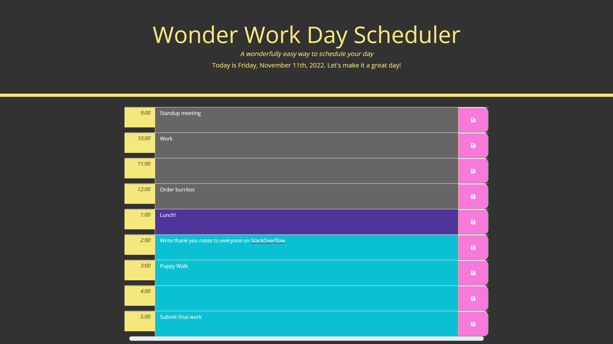

# Wonder Work Day Scheduler
A simple scheduler app coded with JQuery and Moment

## Description 
This app is designed to make scheduling your work day easy. Cover your 9-5 block in a quick and visually appealing way. 

## Installation
No install is necessary! This is a web based application. Simply click the [link](https://cod3burrito.github.io/wonderWorkDayScheduler/)to use the app in your favorite web browser.

### Contributors
This code was written by the codeburrito themself, Robin Allman. Special thanks to Joseph and Charlee for their patience and help as I struggled with JQuery and Moment.js, as they are far kinder than any classmate should be. Additional thanks to the folks who wrote Moment.js. 

### Contact
Any questions? Please feel free to reach out to me on Twitter @cod3burrito.

